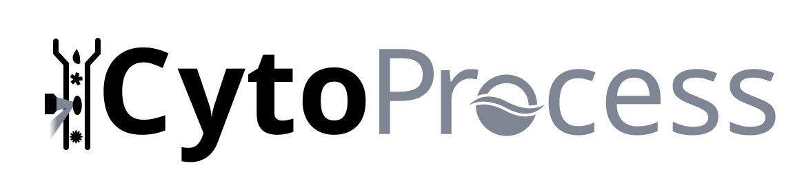

Package to process images and their features from .cyz files from the CytoSense and upload them to EcoTaxa.


## Installation

NB: As for all things Python, you should preferrably install CytoProcess within a Python venv/coda environment. The package is tested with Python=3.11 and should therefore work with this or a more recent version. To create a conda environment, use

```bash
conda create -n cytoprocess python=3.11
conda activate cytoprocess
```

Then install the sable version with

```bash
pip install cytoprocess
```

*or* the development version with

```bash
pip install git+https://github.com/jiho/cytoprocess.git
```

The Python package includes a command line tool, which should become available from within a terminal. To try it and output the help message

```bash
cytoprocess
```

CytoProcess depends on [Cyz2Json](https://github.com/OBAMANEXT/cyz2json). To install it, run

```bash
cytoprocess install
```


## Usage

CytoProcess uses the concept of "project". A project corresponds conceptually to a cruise, a time series, etc. Practically, it is a directory with a specific set of subdirectories that contain all files related to the cruise/time series/etc. It corresponds to a single EcoTaxa project.

Each .cyz file is considered as a "sample" (and will correspond to an EcoTaxa sample).

A project is organised like so

```
my_project/
    config      configuration files
    raw         source .cyz files
    meta        file storing manually-provided metadata for each sample(lat, lon, etc.)
    work        data extracted by the various processing steps
        <sample_id_1>                in one folder per sample
            converted_data.json          file converted from .cyz by Cyz2Json
            cytometric_features.parquet  average cytometric measurement per image
            image_features.parquet       features computed on each image (area, etc.)
            images                       images with scale bar and mask for the particle
            metadata.parquet             instrument metadata extracted from the .json file
            pulses_plots                 plot of the pulse shapes of imaged particles
            pulses_summaries.parquet     polynomial summaries of the pulse shapes
        <sample_id_2>
            ...
    ecotaxa     .zip files ready for upload in EcoTaxa
    logs        logs of all commands executed on this project, split per day
```

A CytoProcess command line looks like

```bash
cytoprocess --global-option command --command-option project_directory
```

To know which global options and which commands are available, use

```bash
cytoprocess --help
```

To know which options are available for a given command

```bash
cytoprocess command --help
```

### Creating and populating a project

Use

```bash
cytoprocess create path/to/my_project
```

Then copy/move the .cyz files that are relevant for this project in `my_project/raw`. If you have an archive of .cyz files organised differently, you should be able to symlink them in `my_project/raw` instead of copying them.


### Processing samples in a project

List available raw samples and create the `meta/samples.csv` file with

```bash
cytoprocess list path/to/my_project
```

Manually enter the required metadata (such as lon, lat, etc.) in the .csv file. You can add or remove columns as you see fit, you can use the option `--extra-fields` (or `-e`) to change the default columns added. The conventions follow those of EcoTaxa.

Then, perform all processing steps, for all samples, with default options 

```bash
cytoprocess all path/to/my_project
```

If you want to know the details, or proceed manually, the steps behind `all` are:

```bash
# convert .cyz files into .json and create a placeholder its metadata
cytoprocess convert path/to/project

# extract instrument provided metadata from each .json file
cytoprocess extract_meta path/to/project
# extract cytometric features for each imaged particle
cytoprocess extract_cyto path/to/project
# compute pulse shapes polynomial summaries for each imaged particle
cytoprocess summarise_pulses path/to/project

# extract images and their features
cytoprocess extract_images path/to/project

# prepare files for ecotaxa upload
cytoprocess prepare path/to/project
# upload them to EcoTaxa
cytoprocess upload path/to/project
```

To check how far along the processing of each sample is, you can use

```bash
cytoprocess status path/to/project
```


### Customisation

To process a subset of samples, use

```bash
cytoprocess --sample 'name_of_cyz_file' command path/to/project
```
which processes this single sample. Or
```bash
cytoprocess --sample '*foo*' command path/to/project
```
which process all samples whose name contains foo.

All commands will skip the processing of a given sample if the output is already present. To re-process and overwrite, use the `--force` option.

For metadata and cytometric features extraction (`extract_meta` and `extract_cyto`), information from the json file needs to be curated and translated into EcoTaxa metadata columns. This is defined in the configuration file `my_project/config/config.yaml`. It contains `key: value` pairs of the form `json.fields.item.name: ecotaxa_name`. To get the list of possible json fields, use the `--list` (or `-l`) option for `extract_meta` or `extract_cyto`; it will write a text file in `config` with all possibilities. You can then copy-paste them to `config/config.yaml`.

Even with all these fields available, the CytoSense does not record some relevant metadata such as latitude, longitude, and date of collection of each sample, which EcoTaxa needs to filter the data or export it to other data bases. You should provide such fields manually by editing the `meta/samples.csv` file.

If you change this metadata or the mapping of fields in `config.yaml` and want to reimport the modified .tsv files on EcoTaxa, you can do so with

```bash
# re-generate the .tsv files with the corrected metadata
cytoprocess prepare --force path/to/project
# re-upload the .tsv only and use "Update metadata" mode
cytoprocess upload --update path/to/project
```


### Cleaning up after processing

Because everything is stored in the EcoTaxa .zip files and can be re-generated from the .cyz files, you may want to remove the intermediate files, in work, as well as old log files, to reclaim disk space. For example, to remove intermediate files and log files older than 20 days

```bash
cytoprocess clean --older-than 20 path/to/project
```

## Development

Fork this repository, clone your fork.

Prepare your development environment by installing the dependencies within a conda environment

```bash
conda create -n cytoprocess python=3.11
conda activate cytoprocess
pip install -e .
```

This creates a `cytoprocess.egg-info` directory at the root of the package's directory. It is safely ignored by git (and you should too).

Now, either run commands as you normally would

```bash
cytoprocess --help
```

or call the module explicitly

```bash
python -m cytoprocess --help
```

Any edits made to the files are immediately reflected in the output (because the package was installed in "editable" mode: `pip install -e ...` ; or is run directly as a module: `python -m ...`).
